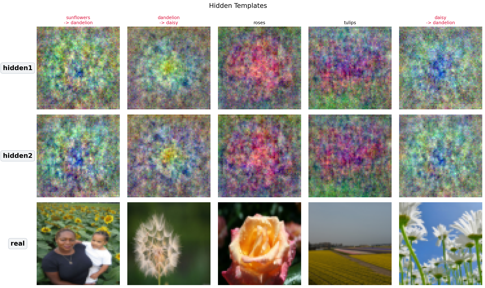
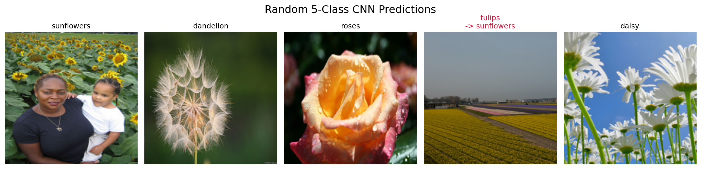
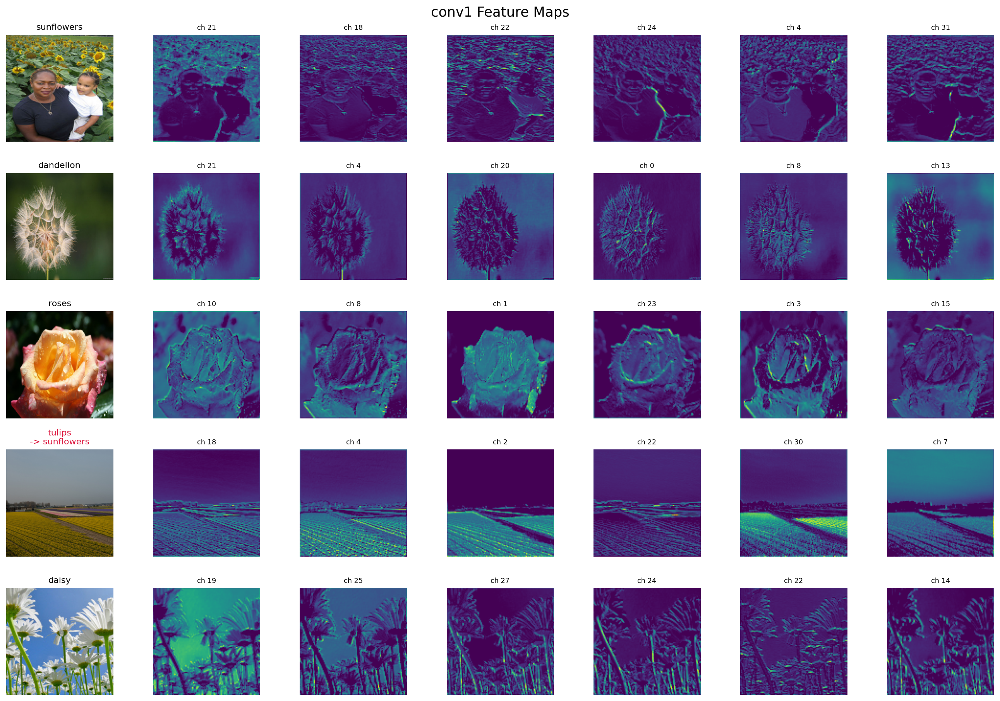
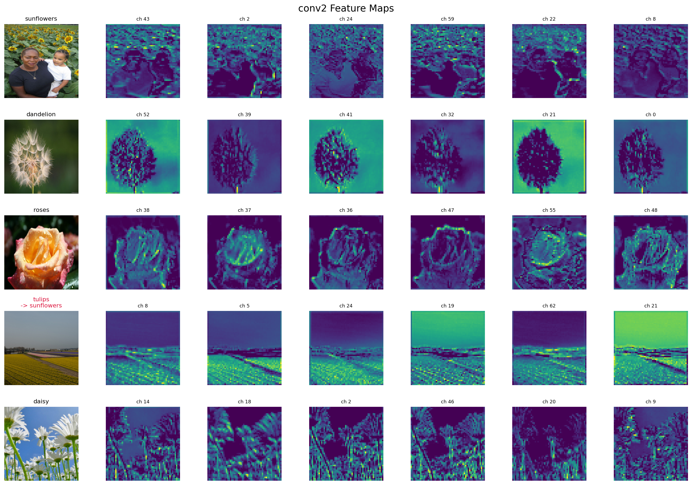
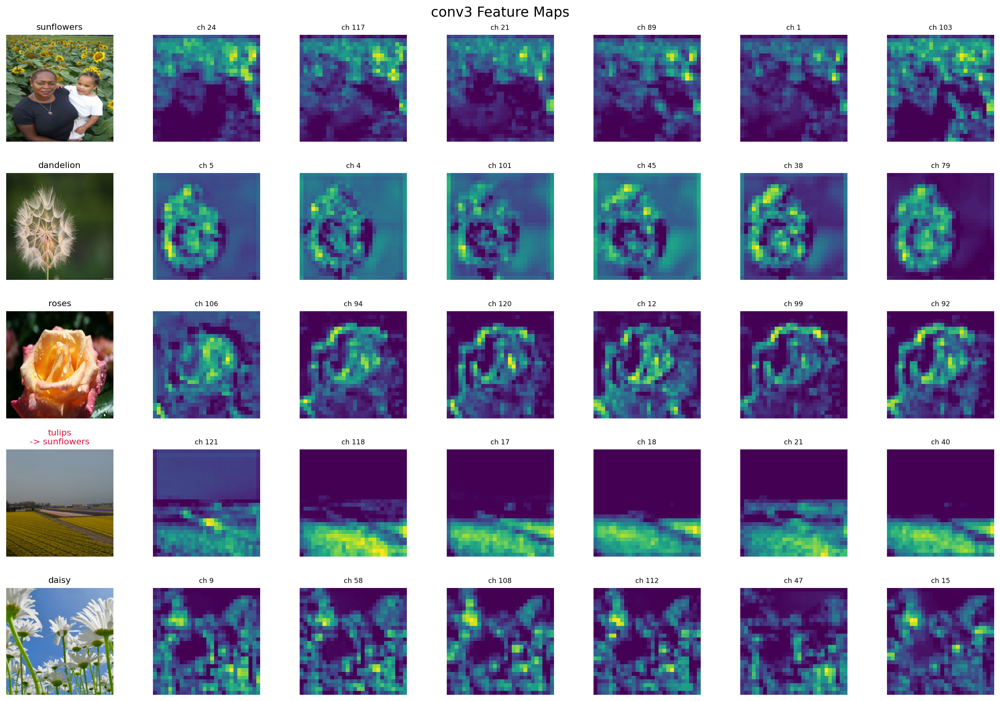

# MLP vs CNN Representation Visualization on `tf_flowers`

This directory studies how two very different models represent the same 5-class image classification problem:

- `flowers_mlp.py`: a plain MLP that sees only flattened pixels
- `flowers_cnn.py`: a small CNN that learns hierarchical spatial features

The main goal is not only classification accuracy, but also **representation analysis**:

- What does an MLP keep in its hidden layers?
- What kinds of visual patterns appear in CNN feature maps?
- Why does CNN usually generalize better on natural images?

## Motivation

In theory, a sufficiently wide MLP can approximate any function, so it can also approximate mappings that a CNN can represent. However, universal approximation is only a statement about **expressive power**, not about whether a model is easy to train, data-efficient, or likely to generalize well.

For image problems, CNNs build the most useful inductive biases directly into the architecture: local connectivity, weight sharing, hierarchical feature composition, and gradually expanding receptive fields. Because of these structural biases, CNNs are much easier to train effectively under finite data, finite compute, and finite training time.

This project is motivated by that gap between theory and practice:

- MLPs are theoretically flexible, but tend to learn mostly global templates on raw pixels
- CNNs are structurally biased toward image data, so they learn more useful local-to-global representations
- the representation difference helps explain why CNNs usually optimize better and generalize better in real image tasks

## Dataset

We use the TensorFlow `tf_flowers` dataset, which contains 5 classes:

- `daisy`
- `dandelion`
- `roses`
- `sunflowers`
- `tulips`

The dataset contains 3670 images in total. The original images are **not fixed-size**. They come in many resolutions, so the training pipeline resizes or crops them to a common size before batching.

This project uses a stratified split:

- train: 2934
- validation: 364
- test: 372

## Project Files

- [flowers_data.py](/home/po/ai/myAI/basic/flowers_data.py): dataset download, split, transforms, and dataloaders
- [flowers_mlp.py](/home/po/ai/myAI/basic/flowers_mlp.py): MLP training and hidden-representation visualization
- [flowers_cnn.py](/home/po/ai/myAI/basic/flowers_cnn.py): CNN training and feature-map visualization
- `artifacts/`: raw outputs from runs
- `imgs/`: copied figures used in this README

## How To Run

Run commands from the `basic/` directory. This is important because the default data path is relative to `basic/`, and running elsewhere may create another dataset copy.

```bash
cd basic

uv run python flowers_mlp.py --epochs 20
uv run python flowers_cnn.py --epochs 30
```

You can also reuse existing checkpoints and only regenerate the visualizations:

```bash
cd basic

uv run python flowers_mlp.py --epochs 0
uv run python flowers_cnn.py --epochs 0
```

## Experimental Setup

### MLP

- input: augmented training crop at `224 x 224`
- architecture: `Flatten -> Linear(150528, 512) -> ReLU -> Linear(512, 128) -> ReLU -> Linear(128, 5)`
- training setup:
  `RandomResizedCrop`, `RandomHorizontalFlip`, `Adam`, and `CosineAnnealingLR`
- purpose of visualization:
  compare `hidden1` and `hidden2` by projecting them back toward input space

Latest recorded MLP result:

- best validation accuracy: `0.5852`
- test accuracy: `0.5296`

### CNN

- input: augmented training crop at `224 x 224`
- architecture:
  3 convolutional stages, each with `Conv + BatchNorm + ReLU + Conv + BatchNorm + ReLU + MaxPool`, followed by `AdaptiveAvgPool + FC`
- training improvements:
  `RandomResizedCrop`, `RandomHorizontalFlip`, `BatchNorm`, `AdamW`, `weight_decay`, and `CosineAnnealingLR`
- purpose of visualization:
  inspect feature maps from `conv1`, `conv2`, and `conv3`

Latest recorded CNN result:

- best validation accuracy: `0.7995`
- test accuracy: `0.8333`

## MLP Representation Analysis

The MLP sees the image as a single long vector. It has no built-in notion of locality, edges, or object parts. Because of that, its hidden representations tend to look like **global color-texture mixtures** instead of clean spatial concepts.

### Hidden Templates

The figure below compares:

- `hidden1`: an earlier hidden representation projected back to image space
- `hidden2`: a deeper hidden representation projected back to image space
- `real`: the corresponding real input image



Observations:

- Both `hidden1` and `hidden2` produce blurry, distributed templates rather than crisp object parts.
- Class evidence is spread over the whole image instead of being localized on petals, centers, or leaves.
- The templates often keep color statistics, but they do not preserve clear flower geometry.
- This is exactly what we expect from an MLP on raw pixels: it learns correlations in the full vector, not spatial structure.

## CNN Representation Analysis

The CNN processes the image through local filters. This gives it a much better inductive bias for natural images.

### Selected Input Samples

The following figure shows the samples selected for CNN feature-map inspection.



### `conv1`: Low-Level Features



What `conv1` usually captures:

- edges
- color blobs
- simple contrast boundaries
- rough foreground/background separation

At this stage, the representation is still generic and local.

### `conv2`: Mid-Level Features



What `conv2` usually captures:

- petal groups
- flower center regions
- leaf-like textures
- repeated local motifs

Compared with `conv1`, these features are more structured and more class-relevant.

### `conv3`: More Semantic Features



What `conv3` usually captures:

- more selective flower regions
- stronger suppression of irrelevant background
- class-specific shapes and arrangements

The feature maps become sparser and more semantic. This is the core reason CNN representations are usually better than MLP representations on image data.

## MLP vs CNN: Main Takeaways

### 1. The MLP mainly learns global templates

In the MLP, each hidden unit receives the **entire flattened image** as input. That means the effective receptive field is global from the very first layer.

As a result, the MLP tends to learn:

- global color-layout templates
- dataset-level texture mixtures
- coarse full-image correlations

This is why the projected `hidden1` and `hidden2` templates look blurry and distributed. They behave more like **whole-image prototypes** than localized detectors for petals, flower centers, or leaf boundaries.

### 2. The CNN learns a higher-dimensional template hierarchy

The CNN does not rely on a single global template space. Instead, it learns a **stack of many channel-wise templates** at many spatial locations.

You can think of it as learning:

- low-level local templates in early layers
- richer mid-level templates in intermediate layers
- higher-dimensional, more semantic templates in deeper layers

Each layer increases the representational richness of the template bank. Instead of matching the whole image at once, the CNN builds a representation from many interacting local responses.

### 3. Local and global receptive fields emerge differently

This is the key structural difference between the two models.

For the MLP:

- every hidden unit immediately sees the whole image
- there is no notion of nearby pixels being more related than far-away pixels
- locality is not built into the architecture

For the CNN:

- early filters have small local receptive fields
- deeper layers see larger effective receptive fields through repeated convolution and pooling
- the network moves naturally from local evidence to global decisions

So the CNN gets both:

- **local sensitivity** in shallow layers
- **global context** in deep layers

That progression is exactly what image recognition usually needs.

### 4. Inductive bias from model structure matters

The representation gap is not only about parameter count or optimization. It comes from the models' built-in inductive biases.

The MLP bias is:

- treat the image as a generic vector
- learn global correlations directly
- ignore explicit spatial structure

The CNN bias is:

- preserve the 2D structure of the image
- reuse the same filters across positions through weight sharing
- compose local patterns into larger patterns
- gradually enlarge the effective receptive field

These architectural biases make the CNN far better matched to natural-image data such as flowers.

### 5. The visualizations explain the accuracy gap

The accuracy difference is a consequence of the different learned representations.

- MLP test accuracy: `0.5323`
- CNN test accuracy: `0.8333`

The MLP does learn useful information, but mostly in the form of global templates. The CNN learns a more structured representation: local edges, textures, parts, and then larger semantic patterns. That is why the CNN both **looks more interpretable internally** and **generalizes better externally**.

## Copied Figures

The key figures referenced in this README are copied into `basic/imgs/`:

- `mlp_random_class_templates.png`
- `cnn_random_class_predictions.png`
- `cnn_conv1_feature_maps.png`
- `cnn_conv2_feature_maps.png`
- `cnn_conv3_feature_maps.png`

These are snapshots from the latest runs and are convenient for reports, notes, and versioning.
