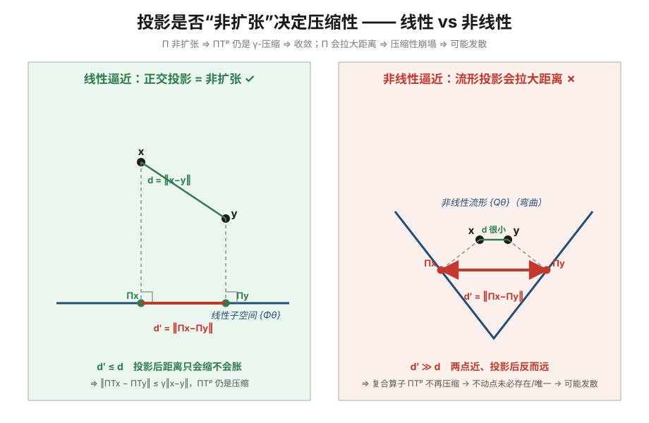

## Deep Q-Network(DQN):收敛性剖析

### 先破题:DQN 的收敛保证其实是最弱的

直觉上容易以为"DQN 能在 control 上收敛,而 TD/MC 会震荡"——**这和理论刚好反过来**。严格说,**表格型的 TD / MC 在 control 上有收敛保证,反而 DQN 没有**。DQN 实践中的稳定是**工程 trick** 的功劳,不是理论优势。要看清这点,先把"收敛"拆成两个正交的问题。

### 一、两个必须分开的问题

| | 问的是 | 由什么决定 |
|---|---|---|
| **问题 1:能不能收敛到"某个值"**(数值稳定 / 会不会震荡) | 迭代过程本身收不收敛 | **更新算子是不是压缩映射(contraction)** |
| **问题 2:收敛到的值对不对**(是不是理论最优 $q^*$) | 不动点等于什么 | **不动点是不是 $q^*$**(表格 vs 逼近、$\max$ 偏差、探索是否充分) |

两者正交,四种组合都可能出现:

| | 收敛到最优 $q^*$ | 收敛到次优/有偏 |
|---|---|---|
| **收敛(不震荡)** | 表格 + GLIE 的理想情况 | 函数逼近 on-policy(稳但有逼近误差) |
| **不收敛(震荡/发散)** | ——(震荡就谈不上最优) | DQN 最坏情况:deadly triad 发散 |

> **问题 1** 靠"算子是不是压缩";**问题 2** 靠"不动点是不是 $q^*$"。表格法两个都有保证;DQN 两个都没有硬保证。

### 二、Deadly Triad(致命三要素)

判断一个算法会不会震荡/发散,看 Sutton 的 **deadly triad**——下面三者**同时出现**才可能发散:

1. **函数逼近**(function approximation,尤其非线性 NN)
2. **自举**(bootstrapping,用估计更新估计)
3. **离策略**(off-policy,行为策略 ≠ 目标策略)

对号入座:

| | 函数逼近 | 自举 | 离策略 | 收敛? |
|---|---|---|---|---|
| 表格 MC(control, GLIE) | ✗ | ✗ | 可有可无 | ✅ 收敛到 $q^*$ |
| 表格 SARSA(GLIE) | ✗ | ✓ | ✗(on-policy) | ✅ 收敛到 $q^*$ |
| 表格 Q-learning | ✗ | ✓ | ✓ | ✅ 收敛到 $q^*$(Watkins 证明) |
| 线性逼近 on-policy TD | ✓ | ✓ | ✗ | ✅ 收敛(到 TD 不动点,误差有界) |
| **DQN** | ✓(NN) | ✓ | ✓ | ❌ **三要素全占,无收敛保证** |

> MC 的特殊性:它**不自举**(用真实回报 $G_t$,无偏采样),所以"震荡"只来自采样方差,靠 $\alpha\to 0$ 就能平息,**不会因 deadly triad 发散**——最老实但方差最大。

### 三、为什么"投影非扩张"是收敛的命根子

这是问题 1 的数学内核,也是从"线性有保证"跌到"非线性没保证"的那道坎。

**收敛证明本来靠什么。** 线性 on-policy TD 能收敛(Tsitsiklis & Van Roy 1997),靠把更新写成两个算子的复合 $\Pi T^\pi$:

- $T^\pi$:Bellman 算子,在 **$d_\pi$ 加权 $L_2$ 范数**下是 $\gamma$-**压缩**。
- $\Pi$:把 $T^\pi$ 的结果**投影回"函数逼近器能表示的集合"**(算完的目标一般不在函数类里,得投回来)。

要让复合 $\Pi T^\pi$ 仍是压缩(从而有唯一不动点、迭代必收敛),就需要**投影是非扩张(non-expansion)**:

$$
\|\Pi x - \Pi y\| \le \|x - y\|
\;\Longrightarrow\;
\|\Pi T^\pi x - \Pi T^\pi y\| \le \|T^\pi x - T^\pi y\| \le \gamma\|x-y\|
$$

**线性成立、非线性破缺** —— 关键在"可表示函数的集合长什么样":

- **线性逼近**:$\{Q_\theta=\Phi\theta\}$ 是**平的线性子空间**。在 $d_\pi$ 范数下往子空间投影是**正交投影**(垂直落下),天然**非扩张**(距离只缩不胀)→ $\Pi T^\pi$ 保住压缩 → 收敛。✅
- **非线性逼近(NN)**:$\{Q_\theta\}$ 是一张**弯曲的流形**,不是平面。往弯曲面上"投影"**不再正交、也不再非扩张**:两个原本很近的点,投到流形上可能被拉得**更远**。$\Pi$ 一旦放大距离,$\Pi T^\pi$ 就**未必压缩** → 不动点可能不唯一甚至不存在 → 迭代可震荡/发散。❌

> 正因如此,**Tsitsiklis & Van Roy 的非线性反例,即使 on-policy 也会发散**——非线性把 on-policy 这层护身符都拿掉了:线性时 on-policy 还能救,非线性时不行。

**非线性还有两个雪上加霜**(投影非扩张的破坏是根因,这两个是叠加):

1. **semi-gradient 不是真梯度,失去"能量函数"兜底。** TD 更新里 target 含 $Q_\theta$,但求梯度时**假装它是常数**,所以更新向量**不是任何损失函数的梯度**。线性时靠投影非扩张仍能证收敛;非线性时既没压缩、又没有 Lyapunov/损失函数保证"每步都在下降"——**两条退路同时断**。
2. **泛化干扰不可控。** 参数 $\theta$ **共享**,更新一个状态会牵动其它状态的 $Q$:表格中各状态独立;线性中由特征重叠决定、可控;**非线性中以任意、不可预测的方式改动别处的 $Q$**——可能把 target 依赖的 $Q(s')$ 推向错误方向,与自举回路耦合成正反馈,越滚越大。

外加**非凸**:即便数值上停下来,也可能停在局部极小/鞍点(这属于问题 2)。

### 四、为什么离策略(off-policy)会打破收敛

第三节攻破的是**函数逼近**这根轴(投影在弯曲流形上不再非扩张)。off-policy 是**另一根独立的轴**:它的杀伤力在于——**即便逼近器是线性(投影在自己范数下仍非扩张),off-policy 照样能让 $\Pi T^\pi$ 失去压缩。**

**On-policy 稳,靠"两把秤对齐"。** 回到复合算子 $\Pi T^\pi$:

- $T^\pi$ 只在 **$d_\pi$ 加权范数** $\|\cdot\|_{d_\pi}$ 下是 $\gamma$-压缩(第三节)。
- $\Pi$ 是"按**采样分布**加权的投影"。on-policy 时你**恰好按 $d_\pi$ 采样**,投影也落在 $\|\cdot\|_{d_\pi}$ 下 → 与 $T^\pi$ 的压缩**同一把秤** → 复合仍压缩。

> 收敛的"巧合"就藏在 **采样分布 = 目标策略分布** 这一句里。

**Off-policy 破在"两把秤错位"。** 你按行为策略分布 $d_\mu$ 采样:

- 投影变成按 $\|\cdot\|_{d_\mu}$ 加权(你更新谁、更新多频繁,由 $\mu$ 决定);
- 但 $T^\pi$ 的压缩只在 $\|\cdot\|_{d_\pi}$ 下成立。
- **"$d_\mu$ 下非扩张" ∘ "$d_\pi$ 下压缩"** 不再保证是压缩——完全可能是**扩张**。此时哪怕投影本身非扩张(线性逼近),复合 $\Pi T^\pi$ 也能放大距离 → 迭代发散。

> 对照第三节:那里"投影非扩张"被**非线性**从内部破坏;这里"投影非扩张"虽在,却因**投影范数($d_\mu$)与 Bellman 压缩范数($d_\pi$)不同**而对不上。同一个 $\Pi T^\pi$ 的压缩性,函数逼近与离策略**从两个独立方向**各自攻破——这正是 deadly triad 要"三者同时"才最险的原因。

**直觉:缺了负反馈的自我强化。**

- **on-policy**:被泛化带偏的状态,正是策略高频重访的状态,下一轮采样自动把它拉回来——**有负反馈**。
- **off-policy**:你可能拼命更新 $\pi$ 几乎不去的状态,共享参数把偏差**传染**给 $\pi$ 真正关心的状态;而后者采样太少,**没机会被纠正**。过度强调的区域一直推、被牺牲的区域推不回来 → 正反馈越滚越大。

**重要性采样:另一条炸的路径。** off-policy 常用比率 $\rho=\frac{\pi(a|s)}{\mu(a|s)}$ 校正分布偏差;当 $\pi,\mu$ 差得远时 $\rho$ 很大,多步情形还要**连乘**、方差爆炸 → 巨大更新步把权重打飞。(Q-learning 用 $\max$ 不显式做 IS,但"状态分布是 $\mu$、bootstrap 目标却用 greedy 动作"是同一个错配。)

**Baird's counterexample:** 目标策略恒选某一动作、行为策略均匀随机(off-policy)+ 线性共享特征(函数逼近)+ TD 自举,三要素齐全。明明存在**可精确表示的完美解**,权重却指数级发散到无穷——deadly triad 最干净的反例。

> **DQN 的 off-policy 从哪来:** replay buffer 里是**旧策略**产生的转移,而 target 用 $\max_{a'}Q(s',a')$ 的 **greedy(目标)策略**——行为 ≠ 目标,天然离策略。三要素就此凑满。

### 五、DQN 用两个 trick 稳化(绕过,而非解决)

DQN = 非线性 + 自举 + 离策略,三要素**最满**,理论上最险。它并没有恢复"投影非扩张",而是用两招**压住**不稳定:

- **Experience Replay(经验回放)**:从 buffer 随机采样,**打散样本时间相关性**,让每个 batch 近似 i.i.d.,削弱泛化干扰与分布错位,更接近稳定的监督训练。
- **Target Network(目标网络)**:target $r+\gamma\max_{a'}Q(s',a';\theta^-)$ 用**冻结的旧参数 $\theta^-$**,隔一段才同步。这把"用自己预测自己"的自举回路**切成分段的监督回归**——每段内 target 固定,不会"你追我、我追你"式共振发散。

一句话:**两招是人为削弱 deadly triad 里的"自举回路"和"样本相关性",让训练近似成稳定的监督回归。** 但这只是**经验稳化**,DQN **仍无收敛的理论证明**。

> $\max$ 算子还带来 **overestimation bias**(问题 2 的偏差来源),Double DQN 就是来修这个的;探索不足(非 GLIE)则会收敛到次优策略。

### 六、收束

- **问题 1(收不收敛)** 由**算子是不是压缩**决定 → 步长、自举回路增益、on/off-policy 分布、逼近器是否让**投影非扩张**。
- **问题 2(收到的对不对)** 由**不动点是不是 $q^*$** 决定 → 表格 vs 逼近(函数类容量)、$\max$ 偏差、探索是否充分。
- **表格法在两个问题上都有保证;DQN 在两个上都没有硬保证**,靠 replay + target network 把问题 1 压稳,靠更大网络 + Double/充分探索尽量逼近问题 2。所谓"DQN 更稳"是**工程稳定化**,不是它天生比 TD/MC 更收敛。
