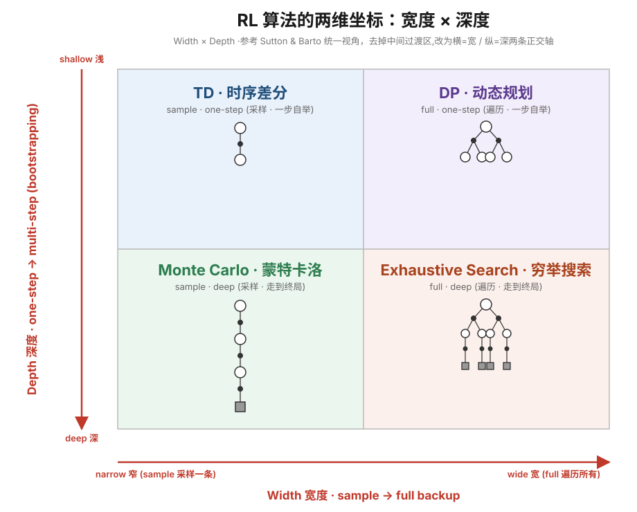
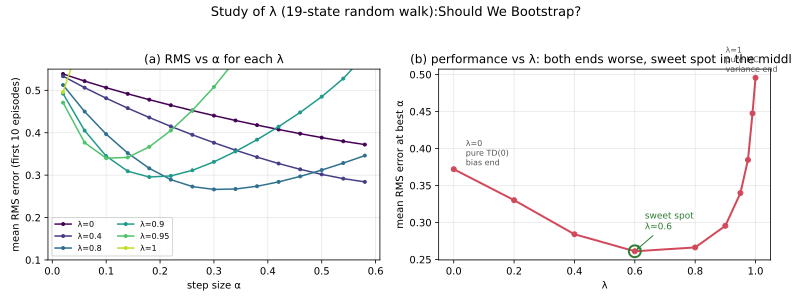

## Temporal Difference Learning

### 为什么取名叫 Temporal Difference?

"Temporal Difference"(时序差分)指的是**相邻两个时刻的价值预测之差**。TD(0) 的更新式:

$$
V(S_t) \leftarrow V(S_t) + \alpha\,\underbrace{\big[\,\overbrace{R_{t+1} + \gamma V(S_{t+1})}^{\text{TD target}} - V(S_t)\,\big]}_{\text{TD error }\;\delta_t}
$$

名字的来源就是中间那个 **TD error** $\delta_t = R_{t+1} + \gamma V(S_{t+1}) - V(S_t)$:它是

- 在**时刻 $t$** 做出的预测 $V(S_t)$,与
- 在**时刻 $t+1$** 修正后的、更好的预测 $R_{t+1} + \gamma V(S_{t+1})$

两者之差。这两个预测**在时间上相邻(temporal)**,它们的**差(difference)**驱动学习——所以叫 temporal difference。学习的本质是:**让前一个时刻的预测,向后一个时刻的预测靠拢**。

> 出处:Sutton, *Learning to Predict by the Methods of Temporal Differences* (1988)。核心思想是「从**时序相邻的预测之差**中学习」,而不是像 MC 那样等到最终结果(回报 $G_t$)出来再学。

**和 Monte Carlo 对比**,看清"差"在哪:

| | 更新目标 | 用到的"未来" |
|---|---|---|
| MC | $V(S_t) \leftarrow V(S_t) + \alpha[\,G_t - V(S_t)\,]$ | 真实回报 $G_t$,需**等到 episode 结束** |
| TD | $V(S_t) \leftarrow V(S_t) + \alpha[\,R_{t+1}+\gamma V(S_{t+1}) - V(S_t)\,]$ | 只用**下一步**的估计($\gamma V(S_{t+1})$),即 **bootstrap** |

MC 的"差"是"预测 vs 真实结果";TD 的"差"是"预测 vs **下一个预测**"。后者不必等到终局,每走一步就能学——这是 TD 的核心优势,也是它名字的由来。

### TD 为什么会收敛到 max likelihood of Markov model?

这是 **batch(批量)TD(0)** 的经典结论:给定**有限**的一批 episode、反复在这批数据上做 TD(0) 更新到收敛,它收敛到的不是别的,正是**用这批数据估出的极大似然 Markov 模型(MLE / certainty-equivalence model)的精确值函数**。

**1. 什么是"极大似然 Markov 模型"**

从数据里把 MDP 的参数用频率/均值估出来:

$$
\hat P(s'\mid s) = \frac{\#\{s \to s' \text{ 的转移}\}}{\#\{\text{访问 } s\}}, \qquad
\hat R(s) = \text{从 } s \text{ 观测到的奖励均值}
$$

这就是与数据最吻合的那个 Markov 模型(转移概率取经验频率,即极大似然估计)。

**2. 为什么TD(0) 收敛到这个模型的精确解**

核心在 **bootstrap**:TD 把"从 $t+1$ 往后的真实回报"直接换成 $V(S_{t+1})$。

$$
G_t \;\approx\; R_{t+1} + \gamma\, V(S_{t+1})
$$

这个替换只有在「到达 $S_{t+1}$ 之后的回报**只由 $S_{t+1}$ 决定、与怎么走到它无关**」时才成立——这**正是 Markov 性质**。所以 **bootstrap 等于把 Markov 假设写进了更新公式**。

正因为假设了 Markov,TD 更新 $V(s)$ 时会**把所有落在 $s$ 的转移合并起来**(不管来自哪条 episode、之前经历过什么),这等价于把转移概率估成经验频率 $\hat P(s'\mid s)$——也就是上面的极大似然模型。于是 batch TD(0) 的不动点,就是该模型下 Bellman 方程的精确解。

> 对比 MC:MC 用整条真实回报 $G_t$,**不 bootstrap、不假设未来只看状态**,所以不会重建 Markov 模型,只是去拟合见过的回报(最小化训练集均方误差)。
>
> 边界:此结论针对 **batch / 有限数据**;online TD(0) 在步长递减、数据 $\to\infty$ 时收敛到真实 $v_\pi$(经验模型 $\to$ 真模型,两者一致)。

### TD 的两个近似:采样+α 近似期望、bootstrap 近似真值

一句话:**TD 是对 Bellman 不动点方程做"随机逼近"——两个近似分别解决"算不出期望"和"等不起完整回报"。**

我们真正想要的目标是精确的、但**算不出来**的:

$$
v_\pi(s) = \mathbb{E}\big[\,R_{t+1} + \gamma\, v_\pi(S_{t+1})\,\big]
$$

这里有**两处拿不到**:① 外面的**期望** $\mathbb{E}$(不知道转移 $P$);② 里面的**真值** $v_\pi(S_{t+1})$。两个近似各解决一个。

**近似1:期望 → 采样 + α 增量平均**

求均值本可写成增量式——从 $V_n = \frac1n\sum_{i} x_i$ 推出:

$$
V_n = V_{n-1} + \frac1n\big(x_n - V_{n-1}\big)
$$

把步长 $\frac1n$ 换成 $\alpha$,就是 TD 里的 `V ← V + α(target − V)`。所以 **α 更新的本质 = "朝新样本挪一小步"的在线平均**:不用知道分布、不用存所有样本,边采样边逼近期望。

- $\alpha = \frac1n$:每个样本**等权**,精确样本均值。
- $\alpha = $ 常数:权重按 $\alpha(1-\alpha)^{\text{age}}$ **指数衰减**,近期样本更重。

**常数 $\alpha$ 为什么等于"指数遗忘"?把递推展开就看见了。** 常数步长下 $V_n=\alpha x_n+(1-\alpha)V_{n-1}$,一层层往回代:

$$
V_n = \alpha x_n + \alpha(1-\alpha)x_{n-1} + \alpha(1-\alpha)^2 x_{n-2} + \dots
      + \alpha(1-\alpha)^{n-1}x_1 + (1-\alpha)^n V_0
$$

第 $k$ 个之前的样本 $x_{n-k}$ 权重是 $\alpha(1-\alpha)^k$ ——**随"年龄"几何衰减**(初值 $V_0$ 的残留 $(1-\alpha)^n$ 也随 $n$ 指数消失)。对比 $\frac1n$ 给每个样本的权重恒为 $\frac1n$(**完全等权**):

| 步长 | 样本 $x_{n-k}$ 的权重 | 语义 |
|---|---|---|
| $\frac1n$ | $\frac1n$(等权) | 精确算术平均,新老一视同仁 |
| 常数 $\alpha$ | $\alpha(1-\alpha)^k$(指数衰减) | 近因加权平均,老样本被指数遗忘 |

所以"$\frac1n\to\alpha$"不是随手一改:它把**等权平均**换成了**指数遗忘的近因加权平均**——这正是幻灯片 "forget old episodes" 的数学来源。

**为什么常用常数 $\alpha$ 而不是 $1/n$?** $1/n$ 能算、且在**目标平稳**时还更精确(精确收敛);但 TD 的 target 含 $V(S_{t+1})$,随学习不断变化(bootstrap 自身非平稳;控制里策略还在变),**早期样本基于很烂的估计、已过时**。$1/n$ 让新老样本一视同仁会被旧数据拖住;常数 $\alpha$ 指数遗忘旧估计,能**追踪移动目标**。代价是不再精确收敛、在真值附近残余抖动(幅度 $\propto\alpha$)——这正对应 Robbins-Monro 条件 $\sum\alpha^2<\infty$ 被破坏。
- 平稳目标(固定策略+固定环境的纯预测)→ 用 $1/n$;非平稳(RL 常态)→ 用常数 $\alpha$。

这就是 **Robbins-Monro 随机逼近**:在 $\sum\alpha=\infty,\ \sum\alpha^2<\infty$ 下,增量平均收敛到真实期望。**它解决"不知道 $P$、算不出期望"** —— 用采样替代了解析的 $\sum_{s'}P(\cdot)$。

**近似2:真实回报 → bootstrap**

把里面的真值 $v_\pi(S_{t+1})$ 用当前估计 $V(S_{t+1})$ 顶替,于是 target 从"完整回报 $G_t$"变成"一步 + 下一状态的估计"。

**凭什么能用估计去更新估计?** 因为 Bellman 递归本身**自洽**:真值 $v_\pi$ 是 Bellman 算子 $T$ 的**不动点**,而 $T$ 是 $\gamma$-**压缩映射**——即使代入不准的 $V$,反复迭代误差也会按 $\gamma$ 倍收缩、最终收敛。**它解决"不想等到 episode 结束才拿到 $G_t$,也想压低方差"**(单步只含一个随机的 $R_{t+1}$,方差远小于整条 $G_t$)。

**统一的思路**

两个近似是**同一个套路**的两面:把一个"精确但不可计算"的量,换成"用手头能拿到的东西逐步逼近":

| | 精确但拿不到 | 近似替代 | 解决的麻烦 |
|---|---|---|---|
| 近似1 | 期望 $\mathbb{E}[\cdot]$ | 采样 + α 增量平均 | 不知道 $P$ |
| 近似2 | 真值 $v_\pi(S_{t+1})$ | 当前估计 $V(S_{t+1})$ | 等不起 $G_t$、方差大 |

合起来就是:**对 Bellman 不动点方程 $v=Tv$ 做随机逼近**——DP 是知道模型、精确算 $T$ 并整步替换;TD 是不知道模型、用采样近似 $T$(近似1)、用一小步 α 代替整步替换(近似2)。所以 TD 可以看作 **"采样版 + 在线版的 DP"**。

### 这两个近似各自要问题满足什么特性?

近似的本质都是「**用问题的某个结构特性,换取可以牺牲的那部分精确性**」(如 cache 吃局部性、Bloom filter 吃容忍假阳)。这两个近似各吃各的特性,缺了对应特性就引入不可控误差。

**采样近似(期望→样本均值)吃「统计可估性」:**

| 需要的特性 | 缺了会怎样 |
|---|---|
| 可交互/可采样 | 没样本,无从估计 |
| (分布)平稳性 | 期望不固定 → 平均出不存在的"平均态" |
| 有限方差 | 重尾 → 均值估计不收敛或极慢 |
| 充分覆盖(探索) | 没采到的状态无依据 |
| 采样分布正确(on-policy 或重要性采样) | 分布错位 → 估成别的策略的值 |

**bootstrap 近似(真值→当前估计)吃「结构自洽性」:**

| 需要的特性 | 缺了会怎样 |
|---|---|
| **马尔可夫性**(最关键) | POMDP → $V(S_{t+1})$ 漏掉历史 → **系统性偏差** |
| 递归可分解(回报对时间可加,Bellman 自洽) | 目标若是轨迹的非可加函数 → 递归不成立 |
| 压缩性($\gamma<1$ 或 episodic 必终止) | $\gamma=1$ 且不终止 → 迭代发散/不唯一 |

**代价是 bias-variance 权衡**:纯采样(MC)无偏但高方差;bootstrap(TD)引入偏差但大幅降方差。Markov 越可靠,这笔"用偏差换方差"的交易越划算;Markov 一旦破(POMDP),就该往 MC 端退。

**失效边界与补救**:非马尔可夫 → 补全状态(历史/RNN/belief);非平稳 → 常数 $\alpha$ 追踪;$\gamma=1$ 不终止 → 加折扣/保证终止;覆盖不足 → 加探索 / off-policy 重要性采样。

### MC vs TD 的"准度"定位:慢 ≠ 不准

上一节从**方差**看了 MC/TD,这里从**偏差(准度)** 收尾,澄清一个常见错觉:**"MC 学得慢"不等于"MC 学不准"**。慢是过程,准是终点,两回事。

**先钉死前提:估的都是平均量,谁都不预测单个样本。**

$V_\pi(s)=\mathbb{E}_\pi[G_t\mid S_t=s]$ 的定义**就是期望**。所以要分清三个量,别粘在一起:

| 量 | 是什么 | 随机吗 |
|---|---|---|
| 回报 $G_t$ | **某一趟**实际走完的总回报(如今天下雨堵车 55 分钟) | 随机,一个**样本** |
| 价值 $V_\pi(s)$ | 从 $s$ 出发**所有可能未来的平均**回报(= 要估的真值) | 确定,一个**期望** |
| 估计 $\hat V(s)$ | 对上面那个平均的**当前猜测** | 学习中 |

- "下雨那趟 55 分钟"是 $G_t$(样本),**不是**估计目标;MC 和 TD **估的是同一个平均 $V_\pi(s)$**,谁也不预测"今天这一趟"。
- TD 看似"随实际情况动态调整",本质是**信息沿状态链更快回传**(bootstrap),外加**状态更细则平均更细**(若天气进了状态,$V(\text{雨})$ 就是"雨天的条件平均",仍是平均量)——不是它能预测单个样本。

**准度分三种场景,结论会反转:**

| 场景 | MC | TD | 谁更准 |
|---|---|---|---|
| **表格 · 极限** | 无偏 → 真值 $v_\pi$ | 有限步有偏,极限 → $v_\pi$ | 打平,都到真值 |
| **表格 · 有限样本** | 偏差 = 0,只是**噪声大** | 有**系统偏差**(用不准的 $V(S_{t+1})$ 自举) | MC 无系统偏差 |
| **函数逼近** | 收敛到**最优投影**(value error 最小) | TD 不动点,最坏差 $\tfrac{1}{1-\gamma}$ 倍 | **MC 更准** |

关键是**函数逼近下的反转**:MC 直接最小化对真值的加权平方误差,收敛到函数类里**离 $v_\pi$ 最近**的那个;TD 收敛到 **TD 不动点**,并非那个最近点,存在额外偏差,经典界为

$$
\|v_{\text{TD}} - v_\pi\|_d \;\le\; \frac{1}{1-\gamma}\,\min_\theta\|v_\theta - v_\pi\|_d
$$

$\gamma\to 1$ 时这个放大越狠。所以**函数逼近下,MC 是误差最小的那个,TD 用偏差换了速度与低方差**。

**收束成一句 bias-variance,并指回旋钮:**

> **TD 拿"偏差"换"低方差 + 快";MC 拿"高方差 + 慢"换"无偏 + 更准的终点"。** 没有免费午餐:要快要稳选 TD,要准要老实选 MC。

而这条 bias-variance 轴的**连续调节旋钮**,正是下一节「两维坐标」纵轴上的 **$n$-step TD / TD($\lambda$)**:$\lambda=0$ 是纯 TD(偏差端),$\lambda=1$ 是纯 MC(方差端),中间连续插值。

### 总结:RL 算法的两维坐标

把 TD 放回整个 RL/DP 的版图来看,**所有"估值"算法都可以按一次更新(backup)如何利用未来,沿两条互相正交的轴来定位**。这两条轴恰好对应前面讲的 TD 两个近似。

**横轴——宽度(width):一次更新看多少种"可能"?**

- **遍历所有分支(full / expected backup)**:用模型 $P$ 把所有后继状态 $s'$ 按概率加权,算出**精确期望**。代表:**DP、穷举搜索**。
- **采样一条(sample backup)**:不知道 $P$,只沿真实经历采到的那一条转移更新。代表:**TD、Monte Carlo**。
- 这条轴就是**近似1(期望 → 采样)**:从"算得出期望"滑向"只能采样估期望"。

**纵轴——深度(depth):一次更新往后看多少步?**

- **一步就 bootstrap(浅)**:只走一步,后面用当前估计 $V(S_{t+1})$ 顶替。代表:**DP、TD**。
- **走到终局(深)**:一路展开到 episode 结束,用真实回报 $G_t$,不 bootstrap。代表:**Monte Carlo、穷举搜索**。
- 这条轴就是**近似2(真值 → bootstrap)**:从"等得起完整回报"滑向"一步截断 + 自举"。

**两轴一交叉,四个角正好是四类经典算法:**

| 深度 ＼ 宽度 | 遍历所有分支(full backup,需模型) | 采样一条(sample backup,免模型) |
|---|---|---|
| **一步 bootstrap(浅)** | **DP**——精确期望 + 自举,需要 $P$ | **TD**——采样 + 自举,低方差、有偏 |
| **展开到终局(深)** | **穷举搜索**——精确期望 + 真值,无偏但指数爆炸 | **Monte Carlo**——采样 + 真值,无偏但高方差,须等终局 |

> 每个角里的小图是该算法的 **backup diagram**:○ 状态、● 动作、▣ 终止态。横向看分叉宽度(采样一条 vs 遍历所有),纵向看链条深度(一步自举 vs 走到终局)。

**怎么读这张图**

- **左 → 右**:从"采样"走向"遍历所有"——拿模型换掉方差(代价是要有模型 $P$)。
- **下 → 上**:从"真实回报"走向"一步 bootstrap"——拿偏差换掉方差和等待(代价是要靠 Markov 自洽)。
- **TD 在左上角**,正是"采样 + 一步自举"两件事同时做到极致:既不要模型(像 MC),又不等终局(像 DP)。它是 **MC 的"免等终局"版**,也是 **DP 的"免模型采样"版**——这也呼应前面那句:**TD = 采样版 + 在线版的 DP**。
- 沿纵轴往中间填,就得到 **$n$-step TD / TD($\lambda$)**(在"一步"与"整条"之间连续插值);沿横轴往中间填,则是 **expected SARSA、DP 的采样近似**等中间形态。整张图是连续谱,四个角只是它的极端端点。

### Eligibility Trace(资格迹):把纵轴"连续填"的机制

上一节说沿纵轴往中间填就得到 TD($\lambda$)。**怎么填**,靠的就是 eligibility trace。

**先看要解决的痛点:选不出的 $n$。**

- **TD(0)**:只用一步,偏差大;一个"惊喜"要跑很多遍 episode 才能一格一格渗透回起点。
- **MC**:用整条回报 $G_t$,方差大,还得等终局。
- **$n$-step TD**:折中,但**得挑一个 $n$**——挑多少?没有好答案。

**前向视角(forward view):干脆把所有 $n$ 加权平均。**

TD($\lambda$) 不挑 $n$,而是把所有 $n$-step 回报按几何权重 $(1-\lambda)\lambda^{n-1}$ 混起来,得到 **λ-return**:

$$
G_t^\lambda = (1-\lambda)\sum_{n=1}^{\infty}\lambda^{n-1} G_t^{(n)}
$$

- $\lambda=0$ → 退化成 TD(0);$\lambda=1$ → 退化成 MC。用一个 $\lambda\in[0,1]$ 连续调 bias-variance。

> **$\lambda=1$ 退化为 MC 的严格来路(别被 $0\times\infty$ 坑了)。** 上面这个无穷和**默认 $\lambda<1$**:权重和 $\sum_{n\ge1}(1-\lambda)\lambda^{n-1}=(1-\lambda)\cdot\frac1{1-\lambda}=1$ 靠 $\frac1{1-\lambda}$ 收敛。$\lambda=1$ 时前缀因子 $(1-\lambda)=0$、和却发散,是 $0\times\infty$ 不定式,**不能直接代**。真实 episodic 任务(在 $T$ 终止)用的是带**残差项**的有限形式——终止后所有 $n\ge T-t$ 的 $n$-step 回报都等于完整回报 $G_t$,其权重合并为 $\lambda^{T-t-1}$:
> $$
> G_t^\lambda = (1-\lambda)\sum_{n=1}^{T-t-1}\lambda^{n-1} G_t^{(n)} \;+\; \underbrace{\lambda^{\,T-t-1} G_t}_{\text{残差项}}
> $$
> $\lambda=1$ 时前半段整体归 0,但**残差项存活为 $1\cdot G_t=G_t$** → 纯 MC。所以不是"每一项都变 0",而是**权重全部堆到最长的那条完整回报上**。($\lambda=0$ 则残差项 $0^{T-t-1}G_t=0$、前半段只剩 $n{=}1$ 项 $G_t^{(1)}$ → TD(0)。)

**但前向公式有致命缺陷**:$G_t^\lambda$ 要看未来所有奖励,**又得等 episode 结束**才能算——丢掉了 TD"每走一步就能在线学"的核心优势。

**后向视角(backward view):eligibility trace 让它可在线计算。**

这就是 trace 存在的**根本理由**:把"要看未来"的前向公式,**数学等价地**改写成"只用当前 $\delta_t$、向后分配"的在线算法。给每个状态挂一个迹:

$$
E_t(s) = \gamma\lambda E_{t-1}(s) + \mathbf{1}[S_t = s]
$$

访问到就 +1(累积),每步按 $\gamma\lambda$ 衰减。然后用**同一个** $\delta_t$ 更新**所有**状态:

$$
V(s) \leftarrow V(s) + \alpha\,\delta_t\,E_t(s)\quad(\forall s)
$$

Sutton 证明:该后向算法(离线时)与前向 λ-return **完全等价**。

**它解决的是 credit assignment(信用分配)。** 走迷宫前面平平无奇、最后一步突然拿大奖励(大 $\delta$):TD(0) 只更新终点前一格,惊喜要多跑几遍才慢慢回传;带 trace 则因为沿途状态的迹还没衰减完,这一个大 $\delta$ **立刻沿刚走过的路径回传**,一次把功劳分给整条轨迹。

> "eligibility"(资格)= 一个状态现在有多大"资格"为刚发生的 error 领功劳。刚访问过 → 资格高;久未访问 → 衰减到接近 0。$\gamma\lambda$ 就是遗忘速率。

### SARSA($\lambda$):$Q$ / $\delta$ / $E$ 三个角色别混

控制版把 trace 挂到 $(s,a)$ 上:

$$
E_t(s,a) = \gamma\lambda E_{t-1}(s,a) + \mathbf{1}[S_t=s,\,A_t=a], \qquad
Q(s,a) \leftarrow Q(s,a) + \alpha\,\delta_t\,E_t(s,a)\quad(\forall s,a)
$$

**常见误解**:以为这是 one-step,只更新采样到的那个 $(S_t,A_t)$。其实每步是**对所有 $(s,a)$ 更新一遍**(按迹加权)。一旦看清这点,$E(s,a)$ 的身份就清楚了——它不是 value,是**分配权重**。更新式里三个符号身份完全不同:

| 符号 | 是什么 | 角色 |
|---|---|---|
| $Q(s,a)$ | value 估计 | **被更新的对象**(左边) |
| $\delta_t$ | 这一步的 TD error | **误差信号**——"刚发现的惊喜有多大" |
| $E(s,a)$ | eligibility trace | **分配权重**——"这个误差里 $(s,a)$ 该领多少" |

- 刚访问过的 $(s,a)$:$E$ 大 → 领到 $\delta_t$ 一大块;久未访问:$E\to 0$ → 几乎不动;从没访问:$E=0$ → 完全不更新(所以不会污染无关的 $Q$)。
- **量纲也自洽**:$\delta_t$ 是"value 的误差",$E$ 是无量纲权重(0~上限),$\alpha\,\delta_t\,E$ 整体仍是"一个 value 增量",加到 $Q$ 上合法。

**为什么"对所有 $(s,a)$"不矛盾——两个澄清:**

1. **SARSA(0) 是特例,不是另一套逻辑。** $\lambda=0$ 时 $E_t(s,a)=\gamma\cdot 0\cdot E_{t-1}+\mathbf{1}[\cdot]$ 每步塌缩成指示函数:只有当前 $(S_t,A_t)$ 的 $E=1$,其余全 0。于是"对所有 $(s,a)$ 更新"退化成"只更新这一个、权重 1"——正是朴素 one-step SARSA。所以从 SARSA(0) 到 SARSA($\lambda$),**变的不是"更新谁"的结构,而是把权重从硬编码的指示函数换成会衰减、能覆盖多个 $(s,a)$ 的迹**。$\lambda$ 就是这条尾巴的长度旋钮。
2. **"对所有 $(s,a)$" 是概念上的;工程上是稀疏的。** 真实实现只有一小撮 $(s,a)$ 的 $E$ 非零(最近走过的尾巴),$\gamma\lambda$ 衰减很快把老的压到可忽略。通常维护一个"活跃迹列表",每步只遍历这几个,并不真扫整个 $\mathcal{S}\times\mathcal{A}$。数学上写"$\forall s,a$"只因 $E=0$ 的项加了等于没加。

### 偏差与方差:先把定义钉死(别和"误差"混)

全文反复用 bias-variance,但极易把**方差**误当成"预测离真值有多远"。关键澄清:**方差量的是"围绕自己的均值抖多厉害",与真值在哪无关;"离真值多远"那是误差/偏差。** 对随机变量 $X$:

$$
\mathrm{Var}(X) = \mathbb{E}\big[(X - \mathbb{E}[X])^2\big]
$$

公式里**根本没有真值**——它只看 $X$ 相对**自己的期望 $\mathbb{E}[X]$** 的散布。而"估计离真值多远"是**误差**,它才拆成偏差与方差两块:

$$
\underbrace{\mathbb{E}[(\hat V - v_\pi)^2]}_{\text{误差 MSE}}
= \underbrace{(\mathbb{E}[\hat V] - v_\pi)^2}_{\text{偏差}^2:\;\text{离真值多远(准不准)}}
+ \underbrace{\mathrm{Var}(\hat V)}_{\text{方差}:\;\text{自己抖多厉害(稳不稳)}}
$$

**射靶比喻**:一堆飞镖,**偏差** = 镖群中心离靶心多远;**方差** = 镖群彼此散得多开(跟靶心无关)。

| | 镖群 | 含义 |
|---|---|---|
| **MC** | 中心对准靶心,但**散得开** | 无偏、**高方差** |
| **TD** | 挤成一小簇,但**簇心偏一点** | 有偏、低方差 |

**那 MC 里"高方差"具体是谁在抖?——学习目标 $G_t$。** MC 更新用的目标是回报 $G_t$,它是随机变量(取决于从 $s$ 出发**一整条随机轨迹**),$\mathrm{Var}(G_t)$ 大 = 同一个状态,不同 episode 采到的 $G_t$ 差别巨大。理解方差前,先破两个常见误解:

- **方差是"每个状态各自一个",不是"只算最终那一个"。** 每个状态 $s$ 都有自己的 $G_t(s)$,因此各有各的方差。而且 arrive home 的方差≈0(已到家、时间已定)——真正抖得厉害的是**早期状态**,最终那个反而最确定。
- **方差是"跨很多 episode(很多天)"的散布,不是"一个 episode 内部"。** 一天对每个状态只给**一个样本** $G_t$,单样本算不出方差;要想象**把这趟车开很多天**,对同一状态收集所有天的 $G_t$,看这堆数**散得多开**。

**具象:同一趟车开三天,列出从每个状态出发的实际剩余时间(= 该状态的 $G_t$)。** MC 就拿这一列的每个数当更新目标。

> **口径说明(这几张表既是目标方差、也是估计量方差)。** 本例取 **$\alpha=1$**(与 Sutton 那张图一致),一步跳到目标,于是学一天之后 $\hat V(s)=$ 目标本身(MC 是 $G_t$、TD 是 $R_{t+1}+V(S')$)。所以**下面每个数就是"那天学出的 $\hat V(s)$",跨天(跨 episode)的散布同时就是分解式里的估计量方差 $\mathrm{Var}(\hat V(s))$** —— α=1 让"目标方差(根源)"与"单次更新后的估计量方差(后果)"数值重合,故不必分开列。(α<1 或多 episode 时平均会压低估计量方差,两者才分开。)

| 状态 | 快 | 中 | 慢 | 平均(≈真值 $V$) | MC 目标散布 |
|---|---|---|---|---|---|
| leaving office | 30 | 40 | 50 | 40 | **最大**(±10) |
| reach car | 28 | 36 | 44 | 36 | 大(±8) |
| exiting highway | 14 | 20 | 26 | 20 | 中(±6) |
| 2ndary road | 8 | 12 | 16 | 12 | 小(±4) |
| home street | 2 | 3 | 4 | 3 | **极小**(±1) |
| arrive home | 0 | 0 | 0 | 0 | **0** |

两个规律一眼可见:**方差是逐状态的(每行一个)**;**越早的状态方差越大,越靠终点越小,到家为 0**——因为从早期状态出发的 $G_t$ 把后面**所有段的随机性**都累积进来了,而 home street 只剩 3 分钟没什么能变。

**换成 TD 目标,方差立刻塌下去。** TD 的目标是 $R_{t+1}+\gamma V(S_{t+1})$ = "这一段实际耗时 + 下一状态的稳定估计"。以 leaving office 为例(下一状态 reach car 的估计 $V\approx36$,只有"办公室→上车"这**一段**耗时随天变:快/中/慢 = 2/4/6):

| leaving office 的更新目标 | 快 | 中 | 慢 | 平均 | 散布 |
|---|---|---|---|---|---|
| **MC**:整段剩余 $G_t$(累积所有段) | 30 | 40 | 50 | 40 | **±10**(全程随机性) |
| **TD**:$R_{t+1}+V(\text{reach car}) = 2/4/6 + 36$ | 38 | 40 | 42 | 40 | **±2**(只剩一段随机性) |

**两者平均都是 40(都对准真值),但 TD 目标只含"一段"的抖动,MC 目标含"全程"的抖动** —— 这就是 bootstrap 把方差压下去的机制:用一个平滑估计 $V(S_{t+1})$ 接管漫长未来,把"累积很多段随机性"砍成"只剩一段"。代价是若 $V(\text{reach car})$ 不准,TD 目标会系统性偏(偏差)。

**把整趟车每个状态都算出来,规律更清楚。** 各状态 TD 目标 = 这段实际耗时 + 下一状态估计($\gamma=1$;估计值 car 36、exit 20、2ndary 12、home st 3、home 0):

| 状态(早 → 晚) | TD 目标 $= R_{t+1}+V(S_{t+1})$ | 快 | 中 | 慢 | **TD 散布** | (对比)**MC 散布** |
|---|---|---|---|---|---|---|
| leaving office | $= 2/4/6 + 36$ | 38 | 40 | 42 | **±2** | ±10 |
| reach car | $= 14/16/18 + 20$ | 34 | 36 | 38 | **±2** | ±8 |
| exiting highway | $= 6/8/10 + 12$ | 18 | 20 | 22 | **±2** | ±6 |
| 2ndary road | $= 6/9/12 + 3$ | 9 | 12 | 15 | **±3** | ±4 |
| home street | $= 2/3/4 + 0$ | 2 | 3 | 4 | **±1** | ±1 |

竖着看两列散布,补出一个关键规律:

- **MC 方差向起点暴涨**(±1 → ±10):$G_t$ 累积的段数越往前越多,随机性层层叠加。
- **TD 方差几乎不随位置变**(恒在一段的量级 ≈±2):不管在哪个状态,TD 目标只暴露"**这一段**"的真实随机性,后面全被固定估计 $V(S_{t+1})$ 接管。
- **两者在终点附近重合**(home street 都 ±1):只剩一段路时,"实跑一段"与"累积剩余"是同一件事,bootstrap 无省可省。

> **所以 bootstrap 的方差红利几乎全落在"离终点远"的早期状态上**:MC 在那儿累积最多段随机性,TD 一步砍到一段。这与 $n$-step 里"$n$ 越大越接近 MC 高方差"是同一件事——**方差随"暴露的真实步数"增长**。**方差削减在早期状态最显著**(它们本来累积得最多)。

**最后厘清:到底"谁"在随机?被估计的真值不随机,估计量才随机。** 这是最容易绕晕的一点:

- **被估计的真值 $v_\pi(s)=\mathbb{E}[G_t\mid s]$ 是确定的数**(一个期望),不随机;
- **估计量 $\hat V(s)$ 是随机变量**——但它随机,是因为**喂进去训练的 episode 是随机的**($\hat V(s)=\hat V(s;\text{这批随机数据})$),**不是因为真值随机**。换一批 episode 训练,就学出不同的 $\hat V(s)$;这堆结果的散布,才是分解式里那个 $\mathrm{Var}(\hat V(s))$。

> 一句话:**你用一个会抖的估计量,去打一个固定的靶心 $v_\pi(s)$。** ($\hat V(S_{t+1})$ 在 TD 目标里会随机,同理是因为**输入 $S_{t+1}$ 随机**——"确定函数 @ 随机输入",不是 $V$ 本身不确定。)

**这样就有两个相连的"方差",别混——一个是根源,一个是后果:**

| | 指什么 | 角色 | 哪张图 |
|---|---|---|---|
| **目标方差** $\mathrm{Var}(G_t)$ / $\mathrm{Var}(R_{t+1}{+}\gamma V(S_{t+1}))$ | 单次更新**目标**有多抖(上面的 ±10 vs ±2) | **根源** | 目标分布图(误差棒) |
| **估计量方差** $\mathrm{Var}(\hat V(s))$ | 不同随机 episode **学出的 $\hat V$** 有多飘 | **后果** | sweet-spot 的 RMS |

**因果链:目标越抖(根源)→ 每次更新越吵 → 学出的 $\hat V$ 越飘、要更多数据/更小 $\alpha$ 才稳(后果)。** MC 的高目标方差,最终就表现为"学出的 $\hat V$ 在不同 run 间飘、收敛慢"。

> 一句话:**方差 = 稳不稳(围绕自己均值的抖动,与真值无关);偏差 = 准不准(均值离真值多远)。** MC 把整条轨迹的随机性全累积进一个 $G_t$,所以抖得厉害 → 高方差,哪怕它无偏。下一节就把这两条轴用实验分别画出来。

### 动手感受:偏差、方差与 λ 的 sweet spot

前面的 bias-variance 都是道理,这里用一个**真值已知、可解析算误差**的经典 MRP 把它跑出来看——**19-state random walk**(Sutton & Barto 图 12.6 用的同一个例子):状态 $1\dots19$,两端终止,起点在中央 $10$;等概率左右走,走入右端 $+1$、左端 $-1$,其余奖励 $0$;真值线性 $v(i)=(i-10)/10$(即 $-0.9\dots+0.9$)。实验脚本见 [td_lambda_study.py](py_codes/td_lambda_study.py),下面几张图都由它生成。

上图是这个 MRP 的结构:19 个非终止状态排成一条链,两端是终止态(走入右端 $+1$、左端 $-1$),起点在正中央 $10$,每步等概率向左/右一格。状态按真值 $v(i)$ 上色(蓝负红正),对称地从 $-0.9$ 到 $+0.9$——因为越靠右越容易先撞到 $+1$ 那端。

**图一:λ 的 sweet spot ——"Should We Bootstrap?"**

- **(a)** 每个 $\lambda$ 对步长 $\alpha$ 的 RMS 曲线(前 10 episode 平均、100 次运行);**(b)** 取每个 $\lambda$ 的最优 $\alpha$,把最好成绩画成"性能对 $\lambda$"。
- 结论一眼可见:**性能对 $\lambda$ 是 U 形,最优不在两端而在中间(此设定下 $\lambda\approx0.6$)**。
  - $\lambda=0$(纯 TD(0)):偏差端——一步自举、信息回传慢,误差偏高。
  - $\lambda=1$(纯 MC):方差端——目标是整条回报,方差大,且对 $\alpha$ 极敏感((a) 中 $\lambda=1$ 的曲线又高又陡)。
  - **中间的 $\lambda$ 同时吃到"低方差"和"信息快速回传",赢下两端。** 这正是 David Silver 课上那张图的核心:**该不该 bootstrap?——该,但别 all-in;混一点最好。**

**图二:把偏差和方差拆开看——学习目标的分布**

固定看状态 $15$(真值 $+0.5$),对每个 $\lambda$ 统计"从该状态出发的学习目标"的**均值(→偏差)** 与**标准差(→方差)**,用误差棒画出(点=均值,棒长=标准差):

- **(a) $V=$ 真值:** 所有 $\lambda$ 的均值都**贴在真值线 $+0.5$ 上(无偏)**,但误差棒随 $\lambda\to1$ **越来越长**——标准差从 $\lambda{=}0$ 的 $0.10$ 一路涨到 $\lambda{=}1$(MC)的 $0.87$。**这一栏隔离出"纯方差":偏差恒为 0,方差随 λ 单调上升。**
- **(b) $V=0$(未训练):** $\lambda=0$ 的目标被自举拉到 $\approx0$(**偏差极大**,真值本是 $0.5$),随 $\lambda\to1$ 均值**爬回真值线**(MC 无论 $V$ 准不准都无偏),同时误差棒同步变长。**这一栏就是完整的 bias-variance 权衡:λ 越大偏差越小、方差越大。**

> **两图合起来讲完整个故事:** 图二说明"为什么 $\lambda$ 是 bias-variance 旋钮"(方差随 $\lambda$ 升、偏差随 $\lambda$(在自举依赖不准 $V$ 时)降),图一说明"于是存在一个折中的 sweet spot"。这也把本文最前面 MC/TD 的定位、中间的 $n$-step / TD($\lambda$) 旋钮、以及这里的经验曲线**闭合成一条线**:$\lambda$ 不是玄学超参,它就是在这条偏差↔方差轴上找那个让总误差最小的点。