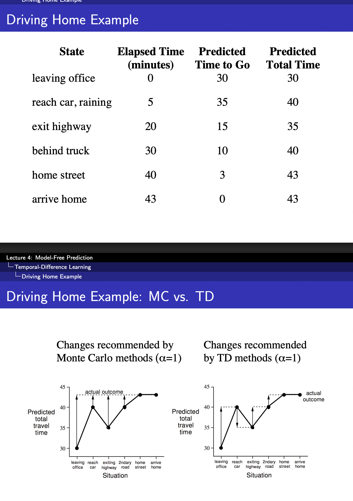
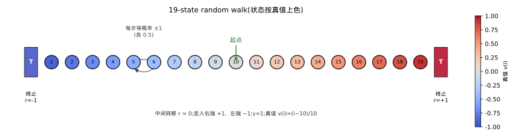
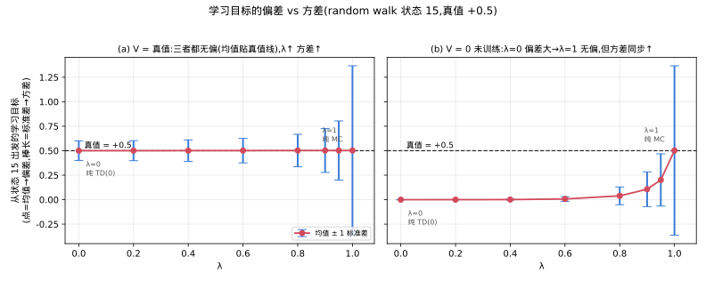
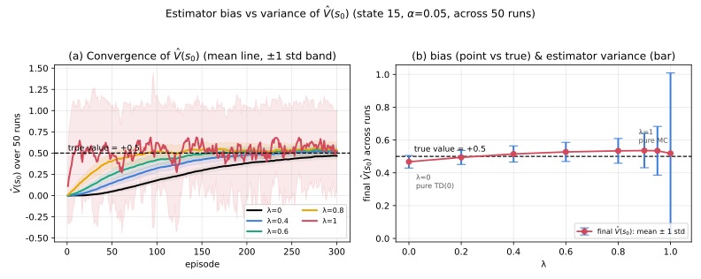

# 动手感受 RL 中的偏差、方差与 TD(λ) 的 sweet spot

**TL;DR**
- 回顾 RL 里最容易被误解的"方差"到底指什么,并通过实验拆出**两种方差**:学习目标的方差(根源)、value function 估计量的方差(后果)
- 用 19-state random walk 扫 TD(λ) 的不同搜索深度 λ,直观感受搜索深度对**收敛速度、方差、偏差**的影响

## Motivation

David Silver 在 [RL第四课中](https://davidstarsilver.wordpress.com/wp-content/uploads/2025/04/lecture-4-model-free-prediction-.pdf)讲解了 Monte Carlo(MC)和 Temporal Difference(TD)会有不同的方差和偏差:**MC 方差高但无偏,TD 则偏差大但方差低**。为了讲方差,他举了一个 Driving Home Example,但这个例子第一次看却非常让人 confusing:



卡住我的有三个问题:

1. 图里其实**只给了一个 episode**(一天的通勤),单条轨迹每个状态只有一个数——**单个样本根本没法计算 policy evaluation 的方差**,方差至少要一堆样本才谈得上"散布"。
2. 更别扭的是:一个 value function **训练好之后**,给定状态 $s$ 输出的其实是**确定的值**,那它也没有方差啊?
3. 还有个更基础的:方差到底是**整个 value function 一个数**,还是**每个 state 各算一个**?我一开始老想着"这个 $V$ 的方差是多少",为此绕了很久。

想通这几点,关键是分清**方差到底附着在谁身上**。先破第 3 点:**方差是逐状态的**——每个 $s$ 都有自己的目标分布、自己的 $\hat V(s)$,因此**各有各的方差**,并不存在"整个 value function 一个方差"这回事(下面 driving home 表里每一行各有一个散布,就是这个意思)。而对**固定的某个状态 $s$**,又藏着两个不同的方差,一个是**根源**、一个是**后果**:

- **学习目标的方差** $\mathrm{Var}(G_t)$:MC 的更新目标是回报 $G_t$,它是随机变量——同一个状态,不同 episode(不同天)采到的 $G_t$ 差别很大。它量的是"你每次拿去更新的靶子波动多大",是方差的**根源**。
- **估计量的方差** $\mathrm{Var}(\hat V(s))$:$\hat V$ 训练好后对固定 $s$ 确实输出确定值——但那是**给定某一批训练数据之后**。把训练数据看成随机的,$\hat V(s)=\hat V(s;\text{随机 episodes})$ 就又是随机变量;换一批 episode 重训,就学出不同的 $\hat V(s)$。它的方差是**跨多次独立 run**的散布,是方差的**后果**。

于是我的困惑就有了答案:(1) 一个 episode 当然算不出方差,要**想象把这趟车开很多天**、对同一状态收集所有天的 $G_t$,看这堆数有多分散;(2) 训练好的 $\hat V$ 之所以"有方差",不是它对 $s$ 的输出会波动,而是**喂给它的数据是随机的**——换批数据就换个 $\hat V$;(3) 全程都是**逐状态**看方差,不同状态的散布可以天差地别(早期状态大、终点附近小)。

对随机变量 $X$,方差形式化定义为:

$$\mathrm{Var}(X) = \mathbb{E}\big[(X-\mathbb{E}[X])^2\big]$$

公式里**根本没有真值**,它只量 $X$ 相对**自己均值 $\mathbb{E}[X]$** 的散布。"离真值多远"是**误差(MSE)**,它才拆成偏差与方差两块:

$$\underbrace{\mathbb{E}[(\hat V - v_\pi)^2]}_{\text{误差 MSE}} = \underbrace{(\mathbb{E}[\hat V]-v_\pi)^2}_{\text{偏差}^2\;:\;\text{准不准}} + \underbrace{\mathrm{Var}(\hat V)}_{\text{方差}\;:\;\text{稳不稳}}$$

一句话:**方差 = 稳不稳(围绕自己均值波动多大,与真值无关);偏差 = 准不准(均值离真值多远)**。用射靶比喻:偏差是镖群中心离靶心多远,方差是镖群彼此散得多开。

### 方差:driving home as example

先看根源——**学习目标的方差**。假设把这趟车开三天(快/中/慢),对每个状态列出:实际剩余时间(= MC 目标 $G_t$,快/中/慢三列)、它们的平均、换成 TD 目标 $R_{t+1}+V(S_{t+1})$ 后的公式(γ=1,下一状态估计取 car 36、exit 20、2ndary 12、home st 3、home 0),以及两种目标各自的散布(方差的代理):

| 状态(早 → 晚) | 快 | 中 | 慢 | 平均(≈真值 $V$) | TD 目标 $=R_{t+1}+V(S_{t+1})$ | MC 散布 | TD 散布 |
|---|---|---|---|---|---|---|---|
| leaving office | 30 | 40 | 50 | 40 | $2/4/6 + 36$ | **±10** | **±2** |
| reach car | 28 | 36 | 44 | 36 | $14/16/18 + 20$ | ±8 | ±2 |
| exiting highway | 14 | 20 | 26 | 20 | $6/8/10 + 12$ | ±6 | ±2 |
| 2ndary road | 8 | 12 | 16 | 12 | $6/9/12 + 3$ | ±4 | ±3 |
| home street | 2 | 3 | 4 | 3 | $2/3/4 + 0$ | ±1 | ±1 |
| arrive home | 0 | 0 | 0 | 0 | $0 + 0$ | **0** | **0** |

三件事一次看清:

- **两种目标的平均都对准真值**:MC 目标(快/中/慢 三列)和 TD 目标逐状态平均都落在真值 $V$ 上——**两者都无偏**。(TD 目标每天的值就是公式里"这段耗时 + 下一状态估计",如 leaving office 的 $2/4/6+36 = 38/40/42$,平均同样是 40。)
- **MC 散布逐状态、且向起点暴涨(±1 → ±10)**:从早期状态出发的 $G_t$ 把后面**每一段的随机性**都累积进来,越早累积得越多;home street 只剩 3 分钟没什么能变(±1),arrive home 已到家(0)。
- **TD 散布几乎不随位置变(≈±2)**:TD 目标只暴露"这一段"的随机性,后面漫长的未来被固定估计 $V(S_{t+1})$ 接管;两者只在终点附近重合(都 ±1,因为只剩一段路时"实跑一段"就等于"累积剩余")。

道理就一句:**MC 目标暴露全程随机性,TD 目标只暴露"这一段"**——这就是 bootstrap 压方差的机制。代价是:若 $V(S_{t+1})$ 不准,TD 目标会系统性偏,这正是 TD 偏差的来源。

## 从两个极端到一个连续旋钮:TD(λ)

Driving Home 只对比了两个极端:MC 一路等到底、TD 只信一步。但两者之间其实是**连续**的——一次更新往后看几步用真实回报、几步之后交给估计?这个"搜索深度"就是一个可以拧的旋钮。

- 看 $n$ 步真实回报、再 bootstrap,就是 **$n$-step TD**:$n=1$ 是 TD,$n\to\infty$ 是 MC。
- 不想挑某个 $n$,就把所有 $n$ 按几何权重 $(1-\lambda)\lambda^{n-1}$ 混起来,得到 **λ-return**,对应 **TD(λ)**:

$$G_t^\lambda=(1-\lambda)\sum_{n\ge1}\lambda^{n-1}G_t^{(n)}$$

$\lambda=0$ 退化成 TD(偏差端)、$\lambda=1$ 退化成 MC(方差端),中间用 $\lambda\in[0,1]$ 连续插值。所以 **λ 就是"折进多少真实未来"的旋钮**:越大越像 MC(方差大、但信息沿状态链回传快),越小越像 TD(方差小、但回传慢、偏差大)。下面这个实验,就是把这个旋钮从 0 拧到 1,同时盯住方差、偏差和收敛速度。

## 动手感受 19-state random walk 下的偏差、方差与 λ 的 sweet spot

前面只是大概的定量计算,例子也稍微简单。换一个**真值已知、可解析算误差**的经典 **Markov Reward Process(MRP,马尔可夫奖励过程)** 把它跑出来看——**19-state random walk**(Sutton & Barto 图 12.6 用的同一个例子):状态 $1\dots19$,两端终止,起点在中央 $10$;等概率左右走,走入右端 $+1$、左端 $-1$,其余奖励 $0$;真值线性 $v(i)=(i-10)/10$(即 $-0.9\dots+0.9$)。(注意是 MRP 不是 MDP:这里**没有动作/决策**,固定策略下只有"状态→奖励"的随机转移,是纯 policy evaluation;有动作可选才叫 MDP。)



上图是这个 MRP 的结构:19 个非终止状态排成一条链,两端是终止态(走入右端 $+1$、左端 $-1$),起点在正中央 $10$,每步等概率向左/右一格。状态按真值 $v(i)$ 上色(蓝负红正),对称地从 $-0.9$ 到 $+0.9$——因为越靠右越容易先撞到 $+1$ 那端。

选它的好处是**真值可解析、误差能精确算**,于是可以把 Motivation 里那两种方差分别落到实处:先看**根源**(学习目标的分布),再看**后果**(value function 这个估计量的偏差与方差)。下面固定盯住一个状态:$s_0=15$,真值 $+0.5$。

### 把偏差和方差拆开看——学习目标的分布

先看**根源**。对每个 λ,统计"从 $s_0$ 出发的学习目标 $G_t^\lambda$"的**均值(→偏差)**与**标准差(→方差)**,用误差棒画出(点=均值,棒长=标准差):



这张图特意分两栏,把"纯方差"和"完整权衡"隔开:

- **(a) $V=$ 真值(bootstrap 用的估计是准的):** 所有 λ 的均值都**贴在真值线 $+0.5$ 上(无偏)**,但误差棒随 $\lambda\to1$ **越来越长**——标准差从 $\lambda{=}0$ 的 $0.10$ 一路涨到 $\lambda{=}1$ 的 $0.87$。**这一栏隔离出"纯方差":偏差恒为 0,方差随 λ 单调上升**,因为 λ 越大、折进的真实未来越多、累积的随机性越多。
- **(b) $V=0$(bootstrap 用的估计还没训练、不准):** $\lambda=0$ 的目标被自举拉到 $\approx0$(**偏差极大**,真值本是 $0.5$),随 $\lambda\to1$ 均值**爬回真值线**(MC 无论 $V$ 准不准都无偏),同时误差棒同步变长。**这一栏就是完整的 bias-variance 权衡:λ 越大偏差越小、方差越大**。

一句话:方差随 λ 单调上升是它的"本性"(a 栏),偏差则取决于 bootstrap 依赖的估计准不准(b 栏)——这就解释了为什么 λ 是一根 bias-variance 旋钮。

### 把偏差和方差拆到"估计量"这一侧——训练后的 $\hat V(s_0)$

上一张拆的是"更新目标"的分布(根源);但我们最终关心的是**学出来的 $\hat V$ 到底好不好**(后果)。所以这次真的训练:**每次跑到收敛(300 个 episode、$\alpha=0.05$),用 50 批独立数据各训练一次**,只盯 $\hat V(s_0)$。

> **口径最关键(别踩坑):** 这里的方差是**跨 50 次独立 run** 的最终 $\hat V(s_0)$ 的散布 $\mathrm{Var}(\hat V(s_0))$,**不是**单次训练内 $\hat V(s_0)$ 逐 episode 的历史波动——后者混进了"还没收敛"的暂态,不是分解式里的估计量方差。偏差同理是**跨 run 的最终值均值**减真值。另外 episode 数一定要取够大:不然 TD 还没学到真值,那个"偏差"只是欠训练的假象,而非算法本身的偏差。



- **图(a) 收敛过程(均值线 ± 1 std 误差带):** **λ 大的收敛快但误差带又宽、波动又大**($\lambda=1$ 几十个 episode 就逼近真值线,但误差带最宽);**λ 小的收敛慢但误差带窄**($\lambda=0$ 要三百个 episode 才逐步爬到 $0.5$,但几乎不波动)。这正是 λ 这根旋钮"信息回传快 ↔ 方差大"两面的直观图像。
- **图(b) 收敛后跨 run 的最终 $\hat V(s_0)$(点=均值,棒长=std):** **所有 λ 的点都落在真值 $0.5$ 附近(收敛后基本无偏)**,差异**纯粹是方差**——误差棒随 λ **单调变长**(std 从 $\lambda{=}0$ 的 $0.04$ 涨到 $\lambda{=}1$ 的 $0.49$)。这是**估计量侧对上一张 (a) 栏的印证**:偏差被训练消掉后,只剩"λ↑ → 方差↑"这条纯方差轴。

**sweet spot 从(a) 图可以看出,** 大 λ 一开始收敛快(早期误差小)但稳态方差大;小 λ 早期收敛缓慢但稳态最稳。于是在**任何有限的训练预算**下,总误差 = 偏差² + 方差:两端各占一个短板(小 λ 早期偏差大、大 λ 全程方差大),**只有中间的 λ 同时吃到"回传快"和"方差可控",总误差最小**——这就是 sweet spot(在本文这个 random walk、早期学习的设定下,把每个 λ 各自调到最优步长 α 再比,实测最优约 **λ≈0.6**;确切位置随训练预算与 α 变动)。它不是玄学超参,而是这根旋钮在"偏差↔方差"轴上的最优折中点。

## 总结
**方差**衡量的是估计量 $\hat V(s)$ 在多次独立训练(runs)后"围绕自己均值波动多大",与它离真值多远无关;它有根源(学习目标)和后果(估计量)两层。而 **λ(搜索深度)**是同时调节偏差与方差的连续旋钮:两者此消彼长,最优值几乎永远落在两端之间(本文设定下约 λ≈0.6)。

需要注意的是:

- **偏差换方差这笔交易,吃的是马尔可夫性。** TD 用 $V(S_{t+1})$ 接管未来,前提是"到达 $S_{t+1}$ 之后的回报只由 $S_{t+1}$ 决定"。状态越接近马尔可夫,这笔"用偏差换方差"越划算;一旦是 POMDP(状态漏了历史),bootstrap 会引入**系统性偏差**,就该往 MC 端退。
- **函数逼近下,MC 和 TD 谁更准可能反过来。** 表格里各 λ 渐近都无偏;但一旦用函数逼近,MC 收敛到"离真值最近的投影"(误差最小),TD 收敛到 TD 不动点、可能被放大 $\tfrac{1}{1-\gamma}$ 倍。这时反而 **MC 更准**,TD 只是拿偏差换了速度和低方差。


## 复现

本文所有图(random walk 结构、学习目标分布、估计量偏差/方差)都由同一个脚本生成,只依赖 numpy 与 matplotlib:

```bash
git clone https://github.com/pochenai/AI.git
cd AI/rl/py_codes
python3 td_lambda_study.py   # 三张 SVG 输出到 ../imgs/
```